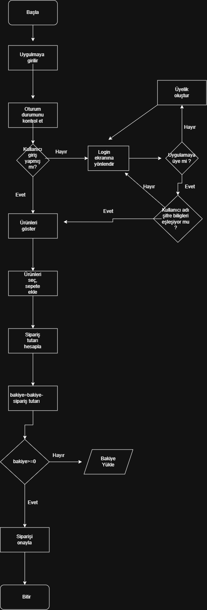

# KahveGo Ödevi

## Görev 1

1-Aşağıda KahveGo sipariş akış şeması bulunmaktadır.

2-

### Sözde Kod
BAŞLA
Uygulamaya gir
Oturum durumunu kontrol et
EĞER kullanıcı giriş yapmış mı? İSE
    Ürünleri göster
DEĞİLSE
    Login ekranına yönlendir
    EĞER uygulamaya üye mi? İSE
        Kullanıcı adı ve şifreyi kontrol et
        EĞER kullanıcı adı ve şifre eşleşiyor mu? İSE
            Ürünleri göster
        DEĞİLSE
            Login ekranına geri dön
        BİTİR

    DEĞİLSE
        Üyelik oluştur
        Login ekranına yönlendir
    BİTİR
BİTİR
DÖNGÜ
    Ürün seç
    Sepete ekle
    EĞER kullanıcı başka ürün eklemek istiyor mu? İSE
        Döngünün başına dön
    DEĞİLSE
        Döngüden çık
    BİTİR
DÖNGÜ SONU
Sipariş tutarını hesapla
Bakiye = Bakiye - Sipariş tutarı
EĞER Bakiye >= 0 İSE
    Siparişi onayla
DEĞİLSE
    Bakiye yükle
BİTİR
BİTİR

## Görev 2

Sipariş Oluşturma Endpoint'i
HTTP Metodu: POST 
URL / Endpoint: /api/v1/siparisler 
Header: 
Authorization: Bearer <token>
Content-Type: application/json
Request Body: 
{
  "kahve_adi": "Latte",
  "boyut": "Orta",
  "adet": 2,
  "toplam_tutar": 185.50
}
Başarılı Sonuç: 201 Created 
Kullanıcı giriş yapmamışsa: 401 Unauthorized
Cüzdan Bakiye Sorgulama Endpoint'i
HTTP Metodu: GET 
URL / Endpoint: /api/v1/kullanici/bakiye 
Header: 
Authorization: Bearer <token>
Response: 
{
  "bakiye": 185.50,
  "para_birimi": "TRY"
}
Sunucuda beklenmeyen hata: 500 Internal Server Error

Mülakat Sorusu: GET idempotenttir, POST idempotent değildir; çünkü GET isteğinin tekrar edilmesi veriyi değiştirmezken, POST isteğinin tekrar edilmesi birden fazla sipariş oluşturabilir

## Görev 3
1-Single Responsibility Principle(SRP)  bir sınıfın birden fazla  sorumluluğun olmamsına dayanan SOLİD prensibidir . Bütün işlemlerin tek bir sınıf içerisinde yapılması bu prensibin ihlaline yol açıyor. Bunun önüne geçmek için indirim, ödeme tipi , veritabanı işlemleri ve bilgilendirme işlemleri için ayrı ayrı sınıflar olşturulması gerekiyor.

2-Cevap Open/Closed Principle – (OCP)  oluyor çünkü her defasında yeni bir güncelleme için aynı kod parçasına ekleme çıkarma yapmak bir yazılımın sürdürülebilir olmasına engel oluyor.
